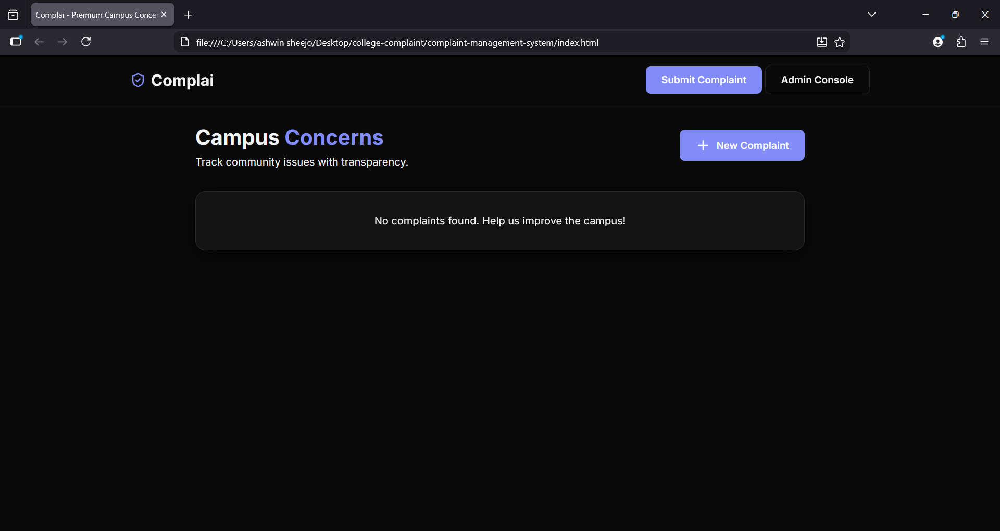

<p align="center">
  
</p>

# COMPLAINT MANAGEMENT SYSTEM 🎯

## Basic Details

### Team Name: NI TEAM

### Team Members
- Member 1: IFRA FATHIMA Y - COLLEGE OF ENGINEERING AND MANAGEMENT,PUNNAPRA
- Member 2: FATHIMA NITHA TM - COLLEGE OF ENGINEERING AND MANAGEMENT,PUNNAPRA

### Hosted Project Link
https://github.com/ifrafathima777-crypto/complaint-management-system

### Project Description
A Complaint Management system is a software application that allows students or customers to submit complaints online and track their status. It helps organizations manage complaints efficiently and improves communications between users and administration.

### The Problem statement
In many colleges an organizations, complaints are handled manually. This leads to delay in response, loss of records, lack of transparency, poor communication.

### The Solution
This problem solves these issues by providing an online platform.

---

## Technical Details

### Technologies
- Languages used: HTML
- Tools used: VS Code, Git

---

## Features

List the key features of your project:
  USERS SIDE:
- Feature 1: Users Registration and Login
- Feature 2: Submit Complaint
- Feature 3: Attach files or photos
- Feature 4: Track complaint status 
- Feature 5: View previous complaints.
  ADMIN SIDE:
- Feature 1: Admin login 
- Feature 2: View all complaints
- Feature 3: Assign complaints to departments 
- Feature 4: Update status (Pending/In progress/Resolved)
- Feature 5: Generate reports

## Implementation

#### Installation
```bash
[Installation commands - e.g., npm install, pip install -r requirements.txt]
```

#### Run
```bash
[Run commands - e.g., npm start, python app.py]
```

---

## Project Documentation

#### Screenshots (Add at least 3)

*Add caption explaining what this shows*

!
*Add caption explaining what this shows*

!
*Add caption explaining what this shows*

#### Diagrams

**System Architecture:**


*Explain your system architecture - components, data flow, tech stack interaction*

**Application Workflow:**


*Add caption explaining your workflow*

---

### For Scripts/CLI Tools:

#### Command Reference

**Basic Usage:**
```bash
python script.py [options] [arguments]
```

**Available Commands:**
- `command1 [args]` - Description of what command1 does
- `command2 [args]` - Description of what command2 does
- `command3 [args]` - Description of what command3 does

**Options:**
- `-h, --help` - Show help message and exit
- `-v, --verbose` - Enable verbose output
- `-o, --output FILE` - Specify output file path
- `-c, --config FILE` - Specify configuration file
- `--version` - Show version information

**Examples:**

```bash
# Example: Basic usage
python script.py input.txt
```

#### Demo Output

**Example: Basic Processing**

**Input:**
```
This is a sample input file
with multiple lines of text
for demonstration purposes
```

**Command:**
```bash
python script.py sample.txt
```

**Output:**
```
Processing: sample.txt
Lines processed: 3
Characters counted: 86
Status: Success
Output saved to: output.txt
```

---

## Project Demo

### Video
[Add your demo video link here - YouTube, Google Drive, etc.]

*Explain what the video demonstrates - key features, user flow, technical highlights*

### Additional Demos
[Add any extra demo materials/links - Live site, APK download, online demo, etc.]

---

## Team Contributions

- [Name 1]: [Specific contributions - e.g., Frontend development, API integration, etc.]
- [Name 2]: [Specific contributions - e.g., Backend development, Database design, etc.]
- [Name 3]: [Specific contributions - e.g., UI/UX design, Testing, Documentation, etc.]

---

## License

This project is licensed under the [MIT] License - see the [LICENSE](LICENSE) file for details.

---

Made with ❤️ at TinkerHub
